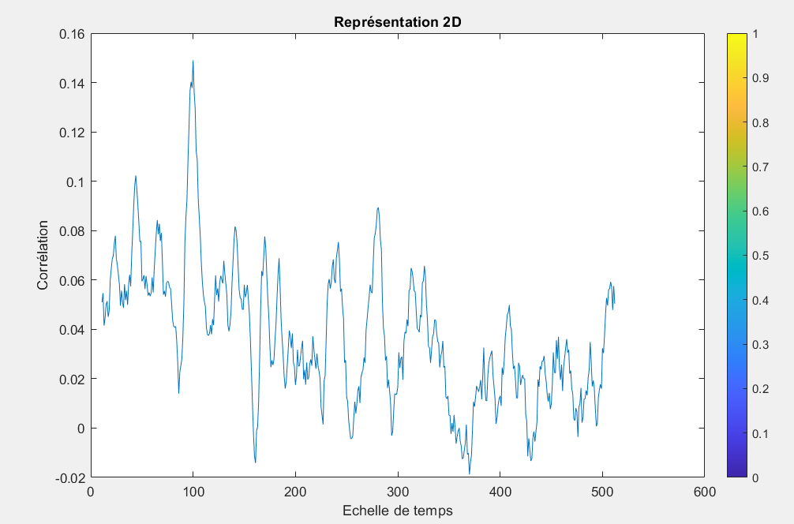
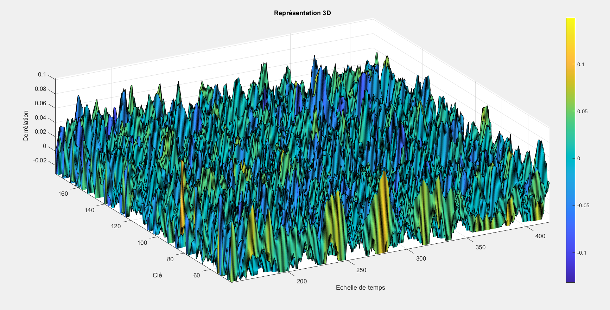

# Projet scolaire en MatLab simulant la partie logiciel d'une attaque CPA d'un chiffrement symétrique AES

## Chargement des données
```matlab
entrees = load('entrees.mat').Entrees1;
subBytes = load('subBytes.mat').SubBytes;
traces = load('traces1000x512.mat').traces;
```
Le code commence par charger les données d'entrée, la table SubBytes, et les traces de consommation d'énergie à partir de fichiers matériels.  

## Initialisation des variables
```matlab
nb_traces = size(traces, 1);
nb_time = size(traces, 2);
nb_keys = 256; 
M_Hamming = zeros(num_traces, num_keys); 
```

Les variables importantes sont initialisées, notamment le nombre de traces, le nombre d'échantillons temporels, le nombre de clés possibles (256 pour une clé d'1 octet), et une matrice pour l'estimation du poids de Hamming.

## Boucle de Traitement des Clés et des Traces
```matlab
for k = 0:nb_keys-1
    for i = 1:nb_traces
        octet_entree = uint8(inputs(i));  
        
        roundKeyOutput = bitxor(octet_entree, uint8(k));
        
        subByteOutput = subBytes(roundKeyOutput+1); 
        
        M_Hamming(i, k+1) = sum(dec2bin(subByteOutput, 8) == '1'); 
    end
end
```
Une double boucle est utilisée pour traiter chaque clé potentielle. Pour chaque clé, la fonction AddRoundKey est simulée en utilisant XOR, suivie de la fonction SubBytes. Le poids de Hamming de la sortie SubBytes est ensuite estimé et stocké dans la matrice de Hamming.

## Calcul de la Corrélation
```matlab
corre = zeros(nb_keys, nb_time);
for k = 1:nb_keys
    for t = 1:nb_time
        M_output = corrcoef(M_Hamming(:, k), traces(:, t));
        corre(k, t) = M_output(1, 2);  
    end
end
```
La corrélation entre les poids de Hamming estimés et les traces de consommation d'énergie est calculée. La corrélation est stockée dans une matrice.

## Identification de la Clé Probable
```matlab
[~, max_index] = max(max(corre, [], 2));
res = max_index - 1;
```
La clé avec la corrélation maximale est identifiée, et la clé probable est stockée dans la variable ``res``.

## Tracé des Résultats
```matlab
plot(corre(max_index, :));
title('Représentation 2D');
xlabel('Echelle de temps');
ylabel('Corrélation');
```
Un graphique 2D de la corrélation entre la clé probable et les échantillons temporels est tracé.

### Graphique obtenu



```matlab
surf(corre);
title('Représentation 3D');
xlabel('Echelle de temps');
ylabel('Clé');
zlabel('Corrélation');
```
Une surface 3D de la corrélation entre toutes les clés et échantillons temporels est tracée.

### Graphique obtenu


